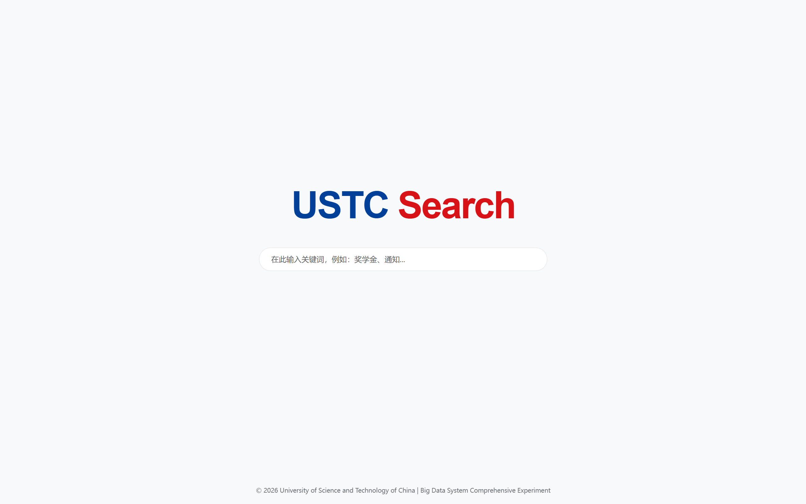
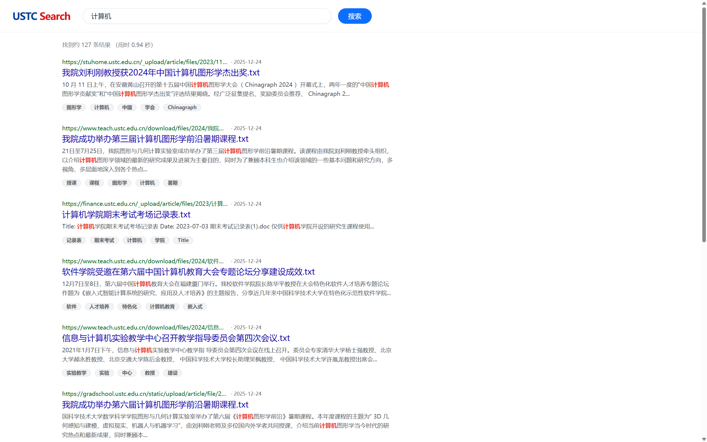
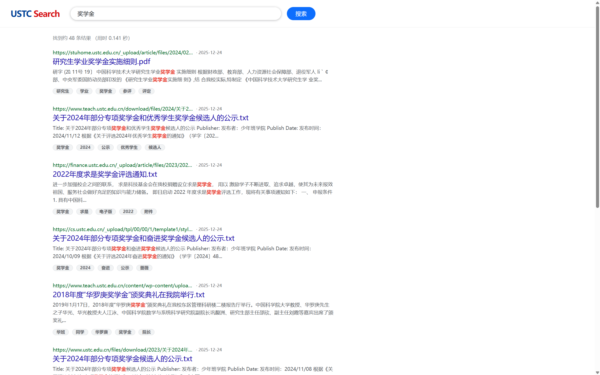

# USTC 分布式校园文档搜索引擎 - 实验报告

**课程名称：** 大数据系统综合实验  
**项目名称：** USTC分布式校园文档搜索引擎  
**完成日期：** 2026年1月  

---

## 一、小组成员与分工

| 姓名 | 学号 | 分工内容 |
|------|------|----------|
| 图力格尔 | PB22051044 | 独立完成全部工作：需求分析、系统设计、爬虫开发、存储架构搭建、Web应用开发、测试与调试 |

---

## 二、技术路线

### 2.1 项目技术栈概览

```
┌─────────────────────────────────────────────────────────┐
│                    技术架构图                            │
├─────────────┬───────────────────┬───────────────────────┤
│   数据采集   │    分布式存储      │      应用层           │
├─────────────┼───────────────────┼───────────────────────┤
│ Python      │ HDFS (文件存储)    │ FastAPI (Web框架)     │
│ Requests    │ HBase (元数据+索引)│ Uvicorn (ASGI服务器)  │
│ BeautifulSoup│ Thrift (RPC通信) │ Bootstrap (前端UI)    │
│ Jieba       │                   │ Jinja2 (模板引擎)     │
└─────────────┴───────────────────┴───────────────────────┘
```

### 2.2 核心技术介绍

#### 2.2.1 网络爬虫技术 (与课程相关)

**Requests库**：Python HTTP客户端库，用于发送网络请求
- 支持Session会话保持，复用TCP连接提高效率
- 配置自动重试策略(Retry)，应对网络波动和服务器5xx错误
- 流式下载(stream=True)，防止大文件撑爆内存

**BeautifulSoup库**：HTML/XML解析库
- 使用`html.parser`解析器提取页面中的超链接
- 实现BFS广度优先搜索策略进行链接发现

**反爬对抗策略**：
- 随机User-Agent轮换(模拟多浏览器访问)
- 随机延时3-6秒(模拟人类浏览行为)
- 异常退避机制(检测到封禁后休眠60秒)

#### 2.2.2 分布式存储技术 

**HDFS (Hadoop Distributed File System)**：
- 用于存储爬取的原始文件(PDF/DOC/DOCX等)
- 基于MD5哈希命名实现文件去重
- 通过WSL调用HDFS命令行完成跨系统文件传输

**HBase (分布式列族数据库)**：
- 存储文档元数据(URL、标题、日期)
- 存储文档内容摘要(用于全文检索)
- 存储关键词索引(Jieba提取的TF-IDF关键词)
- 使用happybase库通过Thrift协议连接

**表结构设计**：
```
表名: ustc_search_engine
行键: URL的MD5哈希值(32位定长,高效索引)
列族:
  - meta: 元数据 (url, title, type, date)
  - data: 内容数据 (hdfs_path, content)
  - index: 检索索引 (keywords)
```

#### 2.2.3 中文自然语言处理

**Jieba分词库**：
- 使用TF-IDF算法提取文档关键词(Top 5)
- 支持中文分词，适配校园文档场景
- 关键词用于构建离线索引，加速检索

**文档解析**：
- pdfplumber：解析PDF文档提取文本
- python-docx：解析Word文档提取段落

#### 2.2.4 Web应用技术

**FastAPI框架**：现代高性能Python Web框架
- 基于ASGI异步服务器，支持高并发请求
- 自动API文档生成（Swagger UI）
- 路由映射：首页、搜索、下载三个核心接口
- 模板渲染：使用Jinja2引擎生成动态页面
- 类型提示和自动参数校验（Pydantic）

**Uvicorn服务器**：轻量级ASGI服务器
- 基于uvloop高性能事件循环
- 支持HTTP/1.1和WebSocket
- 适合生产环境部署

**搜索算法**：三维加权相关度计分
```
Score = 标题命中×100 + 关键词命中×50 + 正文词频×1(上限20)
```

---

## 三、实现功能介绍与效果展示

### 3.1 功能一：分布式网络爬虫

**功能描述**：  
自动爬取USTC校内各部门网站的文档资源，支持PDF、DOC、DOCX、XLS、XLSX等格式。

**技术特点**：
- BFS广度优先搜索策略
- 域名过滤(仅爬取ustc.edu.cn)
- URL去重(MD5哈希)
- 文件优先队列(文档链接优先处理)
- 流式下载(15MB上限)

**爬取来源**：
- 教务处 (teach.ustc.edu.cn)
- 研究生院 (gradschool.ustc.edu.cn)
- 财务处 (finance.ustc.edu.cn)
- 学工处 (stuhome.ustc.edu.cn)
- 计算机学院、信息学院等院系

**效果展示**：
```
[运行日志示例]
14:23:15 [INFO] Crawler started. Seeds: 26
14:23:18 [INFO] Status: 0 scanned | 0 files saved. Current: https://www.teach.ustc.edu.cn/download/all...
14:23:25 [INFO] [SAVED] 本科生学籍管理规定.pdf
14:23:32 [INFO] [SAVED] 2024-2025学年校历.docx
14:24:01 [INFO] Status: 10 scanned | 5 files saved. Current: https://gradschool.ustc.edu.cn/...
...
16:45:33 [INFO] Task finished. Total files: 1247
```

### 3.2 功能二：分布式存储系统

**功能描述**：  
将爬取的文件存储到HDFS，元数据和索引存储到HBase。

**存储架构**：
```
HDFS: /search_engine/raw_data/
  ├── a1b2c3d4e5f6...abc.pdf    (文件以MD5命名)
  ├── 1234abcd5678...xyz.docx
  └── ...

HBase: ustc_search_engine
  ┌────────────────┬─────────────────────────────────────┐
  │ Row Key        │ Column Families                     │
  ├────────────────┼─────────────────────────────────────┤
  │ md5(url)       │ meta:url, meta:title, meta:date     │
  │                │ data:hdfs_path, data:content        │
  │                │ index:keywords                      │
  └────────────────┴─────────────────────────────────────┘
```

### 3.3 功能三：Web搜索界面

**功能描述**：  
提供类似Google风格的搜索界面，支持关键词检索和文件下载。

**主要功能**：
1. **关键词搜索**：输入关键词返回相关文档列表
2. **相关度排序**：按三维计分模型排序结果
3. **摘要高亮**：关键词在摘要中红色高亮显示
4. **分页展示**：每页10条结果，支持翻页
5. **文件下载**：点击可直接从HDFS下载原文件

**界面效果**：

**首页界面**：


**搜索结果页**：




## 四、核心代码块

### 4.1 BFS爬虫主循环

```python
def run(self):
    """BFS主循环: 队列处理直到达到MAX_PAGES或队列为空"""
    logger.info(f"Crawler started. Seeds: {len(self.queue)}")
    count = 0
    
    while self.queue and count < Config.MAX_PAGES:
        url = self.queue.popleft()
        # 用MD5哈希作为去重键(固定长度、高效)
        url_hash = hashlib.md5(url.encode()).hexdigest()
        
        if url_hash in self.visited: continue
        
        try:
            # 流式下载(避免大文件内存溢出)
            resp = self.session.get(
                url, 
                headers=self._get_headers(), 
                timeout=30, 
                stream=True
            )
            
            if resp.status_code == 200:
                self._process_response(resp, url, url_hash)
        except Exception as e:
            # 连接被中断时长时间休息(避免IP封禁)
            if "10053" in str(e) or "Connection aborted" in str(e):
                logger.warning("Connection aborted. Sleeping 60s...")
                time.sleep(60)

        self.visited.add(url_hash)
        count += 1
        # 随机延时防封(模拟人类浏览行为)
        time.sleep(random.uniform(*Config.DELAY_RANGE))
```

### 4.2 文件存储到HDFS

```python
def save_file_to_hdfs(self, content, ext):
    """保存文件到HDFS，使用MD5命名实现去重"""
    file_hash = hashlib.md5(content).hexdigest()
    filename = f"{file_hash}{ext}"
    hdfs_path = f"{Config.HDFS_ROOT}/{filename}"
    
    # 通过WSL管道传输到HDFS(避免临时文件)
    cmd_str = f'wsl {Config.HDFS_BIN} dfs -put -f - "{hdfs_path}"'
    
    process = subprocess.Popen(
        cmd_str,
        shell=True,
        stdin=subprocess.PIPE,
        stdout=subprocess.PIPE,
        stderr=subprocess.PIPE
    )
    stdout, stderr = process.communicate(input=content)
    
    if process.returncode == 0:
        return hdfs_path
    return None
```

### 4.3 HBase元数据存储

```python
def _handle_file(self, resp, url, url_hash, ext):
    """文件处理: 下载 -> 解析 -> 存储元数据"""
    # ... 文件下载代码省略 ...
    
    hdfs_path = self.storage.save_file_to_hdfs(content, ext)
    
    if hdfs_path:
        # 提取文本内容和关键词
        text = ContentParser.parse_text(content, ext)
        keywords = ContentParser.extract_keywords(text)
        
        # 构造HBase行数据
        data = {
            b'meta:url': url.encode(),
            b'meta:title': fname.encode('utf-8', 'ignore'),
            b'meta:type': b'file',
            b'meta:date': time.strftime("%Y-%m-%d").encode(),
            b'data:hdfs_path': hdfs_path.encode(),
            b'data:content': text[:5000].encode('utf-8', 'ignore'),
            b'index:keywords': keywords.encode('utf-8', 'ignore')
        }
        self.storage.save_metadata(url_hash, data)
```

### 4.4 三维相关度计分搜索

```python
@app.get('/search', response_class=HTMLResponse)
async def search(request: Request, q: str = "", page: int = Query(default=1, ge=1)):
    query = q.strip()
    scored_results = []

    for key, data in table.scan():
        title = data.get(b'meta:title', b'').decode('utf-8', 'ignore')
        content = data.get(b'data:content', b'').decode('utf-8', 'ignore')
        keywords_list = data.get(b'index:keywords', b'').decode().split(',')

        score = 0

        # 基础过滤
        if query not in title and query not in content:
            continue

        # 维度一: 标题命中(权重100)
        if query in title:
            score += 100

        # 维度二: 关键词命中(权重50)
        if query in keywords_list:
            score += 50

        # 维度三: 正文词频(权重1,上限20)
        term_count = content.count(query)
        score += min(term_count, 20)

        scored_results.append({'score': score, ...})

    # 按分数排序
    scored_results.sort(key=lambda x: x['score'], reverse=True)

    # 返回模板响应
    return templates.TemplateResponse('result.html', {
        "request": request,
        "query": query,
        "results": scored_results,
        ...
    })
```

### 4.5 HDFS文件下载接口

```python
@app.get('/download/{row_key:path}')
async def download(row_key: str):
    """从HDFS流式下载文件"""
    # 查询HBase获取HDFS路径
    data = table.row(row_key.encode())
    hdfs_path = data.get(b'data:hdfs_path', b'').decode()
    file_name = data.get(b'meta:title', b'download.file').decode()

    # 通过WSL调用HDFS读取文件
    cmd = f'wsl {HDFS_BIN} dfs -cat "{hdfs_path}"'
    process = subprocess.Popen(cmd, shell=True,
                               stdout=subprocess.PIPE,
                               stderr=subprocess.PIPE)
    file_data, stderr = process.communicate()

    # 返回二进制响应(触发浏览器下载)
    from urllib.parse import quote
    encoded_filename = quote(file_name)
    return Response(
        content=file_data,
        media_type="application/octet-stream",
        headers={
            "Content-Disposition": f"attachment; filename*=UTF-8''{encoded_filename}"
        }
    )
```

---

## 五、个人总结与心得

### 5.1 踩坑记录

#### 坑1：HBase连接超时
**问题**：频繁出现`TTransportException: Connection timed out`错误  
**原因**：HBase Thrift服务默认超时较短，网络延迟导致连接断开  
**解决**：增加happybase连接超时参数`timeout=30000`，并在异常时重连

#### 坑2：大文件内存溢出
**问题**：爬取大型PDF文件时Python进程被系统杀死  
**原因**：`requests.get()`默认将整个响应加载到内存  
**解决**：使用`stream=True`流式下载，分块读取并设置15MB上限

#### 坑3：WSL与Windows文件传输
**问题**：无法直接使用Python操作WSL中的HDFS  
**原因**：happybase只能连接HBase，无法操作HDFS  
**解决**：通过`subprocess`调用WSL命令，使用管道(`stdin`)传输二进制数据，避免临时文件

#### 坑4：爬虫被封禁
**问题**：爬取一段时间后出现大量连接失败  
**原因**：请求频率过高触发服务器反爬机制  
**解决**：
- 随机User-Agent轮换
- 随机延时3-6秒
- 检测到封禁后休眠60秒

#### 坑5：HBase中文乱码
**问题**：存储的中文文件名显示乱码
**原因**：未指定UTF-8编码
**解决**：所有字符串使用`.encode('utf-8', 'ignore')`编码，读取时使用`.decode('utf-8', 'ignore')`

#### 坑6：Flask迁移FastAPI模板路径问题
**问题**：重构为FastAPI后，访问首页出现`TemplateNotFound`错误
**原因**：Flask自动以脚本文件所在目录为基础解析`templates/`，而FastAPI的`Jinja2Templates`使用当前工作目录（CWD）
**解决**：使用绝对路径配置模板目录
```python
BASE_DIR = os.path.dirname(os.path.abspath(__file__))
templates = Jinja2Templates(directory=os.path.join(BASE_DIR, "templates"))
```


### 5.2 错误总结

1. **忽视异常处理**：初期代码缺少try-catch，单个URL失败导致整个爬虫崩溃
2. **资源未释放**：HBase连接未及时关闭，导致连接池耗尽
3. **硬编码配置**：IP地址写死在代码中，迁移环境时需要修改多处

### 5.3 实验收获

1. **分布式系统实践**：深入理解了HDFS和HBase的设计理念——HDFS适合大文件顺序读写，HBase适合海量小数据随机访问

2. **爬虫工程化**：学会了如何构建一个健壮的爬虫系统，包括去重、限速、容错、反爬对抗等关键技术

3. **全栈开发能力**：从数据采集、存储设计到Web应用开发，完整经历了一个搜索引擎的全生命周期

4. **调试技巧**：学会了在分布式环境下定位问题，如检查HBase Shell、HDFS命令行、查看日志等

5. **性能优化意识**：理解了为什么需要倒排索引（当前全表扫描在数据量大时会很慢），为后续优化指明方向

6. **框架迁移实践**：成功将Web后端从Flask重构为FastAPI，体验了现代异步框架的优势：
   - **性能提升**：ASGI异步架构相比WSGI同步处理更高效
   - **类型安全**：Pydantic自动参数校验减少运行时错误
   - **开发体验**：自动生成的API文档（访问`/docs`）极大提升开发调试效率
   - **框架差异理解**：深刻理解了不同框架对路径解析、请求处理等细节的差异

### 5.4 未来改进方向

1. **引入Elasticsearch**：替换全表扫描，实现真正的倒排索引检索
2. **增加分布式爬虫**：使用Scrapy-Redis实现多节点并行爬取
3. **支持增量更新**：定期检测文档变化，更新索引
4. **用户功能完善**：增加用户登录、收藏、搜索历史等功能

---

## 六、参考资料

1. Apache HBase官方文档: https://hbase.apache.org/
2. Apache Hadoop HDFS文档: https://hadoop.apache.org/docs/stable/hadoop-project-dist/hadoop-hdfs/
3. FastAPI官方文档: https://fastapi.tiangolo.com/
4. Uvicorn官方文档: https://www.uvicorn.org/
5. Jieba分词库: https://github.com/fxsjy/jieba
6. Beautiful Soup文档: https://www.crummy.com/software/BeautifulSoup/bs4/doc/

---
